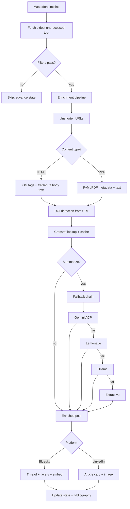

# scholarposter

Cross-post Mastodon toots to Bluesky and LinkedIn with automatic enrichment,
summarization, and paper discovery.

## Features

- **Cross-post** with DOI/abstract enrichment, link cards, and media
- **Thread** long posts on Bluesky (grapheme-safe, AT Protocol compliant)
- **Filter** by hashtag, content type, or reblog status per platform
- **Summarize** shared papers via Gemini, Lemonade, Ollama, or extractive fallback
- **Export** a BibTeX bibliography of everything you've shared
- **Enrich** any URL from the terminal — DOI, title, abstract, summary
- **Discover** new papers matching your interests via OpenAlex
- **Notify** on failure via ntfy, Signal, or email

## How it works



---

## Installation

Requires Python 3.11+ and git.

```bash
git clone <repo-url> scholarposter-src
cd scholarposter-src
./install.sh ~/scholarposter
```

The script creates a virtualenv, installs dependencies, and scaffolds `config.toml`
and `.env` from their examples. Re-running upgrades in place without overwriting
config.

Verify:

```bash
~/scholarposter/.venv/bin/scholarposter --help
```

### Post-install setup

- [ ] **Mastodon credentials** — see [docs/auth-mastodon.md](docs/auth-mastodon.md)
- [ ] **Edit `config.toml`** — set instance URL and credentials file path
- [ ] **Fill in `.env`** — Bluesky app password and LinkedIn token (see [docs/auth-linkedin.md](docs/auth-linkedin.md))
- [ ] **Summarization** (optional) — see [docs/summarization.md](docs/summarization.md)

---

## Workflows

### Cross-posting

```bash
scholarposter run                      # all platforms
scholarposter run --platform bluesky   # single platform
scholarposter run --dry-run            # simulate without posting
```

Each invocation processes one toot (the oldest unprocessed). Schedule via cron to
process the backlog continuously.

### Retrying a failed post

```bash
scholarposter retry --platform bluesky --toot-id 123456789
```

Fetches the specific toot by ID, re-enriches it, and posts to the given platform.

### Checking status

```bash
scholarposter status
```

Shows last-posted toot ID, status, pending count, and last error per platform.

### Exporting your bibliography

Every successful post with a DOI automatically saves the paper's metadata (title,
authors, abstract, publication year) to `bibliography.json`.

```bash
scholarposter bibliography                          # BibTeX to stdout
scholarposter bibliography --format markdown        # Markdown reading list
scholarposter bibliography --format json            # JSON
scholarposter bibliography --output refs.bib        # write to file
```

### Enriching a URL

Look up metadata for any URL without posting:

```bash
scholarposter enrich https://arxiv.org/abs/2401.12345
scholarposter enrich https://doi.org/10.1234/foo --json
scholarposter enrich https://example.com/paper --no-summarize
```

Prints title, DOI, abstract, resolved URL, and summary.

### Discovering new papers

Suggest recent papers by authors you frequently share:

```bash
scholarposter discover                    # last 30 days, top 10
scholarposter discover --days 7 --limit 5
scholarposter discover --json
```

Queries OpenAlex based on your bibliography's author frequency. Excludes papers
you've already shared.

### Validating configuration

```bash
scholarposter config validate
```

Prints parsed config with sensitive fields redacted.

---

## Global flags

All commands accept:

| Flag | Effect |
|------|--------|
| `--config PATH` | Config file (default: `config.toml`) |
| `--verbose` | DEBUG logging to stderr |
| `--quiet` | Suppress INFO, show WARNING and above |

Full CLI reference: [docs/commands.md](docs/commands.md)

---

## Configuration

All settings live in `config.toml` ([TOML](https://toml.io/) format).
See [docs/configuration.md](docs/configuration.md) for the complete reference.

Key sections:

- `[mastodon]` — instance URL and credentials file
- `[platforms.bluesky]` / `[platforms.linkedin]` — per-platform filters, media, hashtag rules
- `[enrichment]` — DOI lookup, summarization (4 backends), URL unshortening
- `[[notifications.backends]]` — failure alerts (ntfy, signal, email)
- `[logging]` / `[state]` — log rotation, state file paths

State files (`state.json`, `cache.json`, `bibliography.json`, lock file) are resolved
relative to the directory containing `config.toml`, so all commands operate on the
same files regardless of working directory.

---

## Summarization

scholarposter supports four summarization backends in a fallback chain:

```
gemini → lemonade → ollama → extractive
```

The extractive backend (sumy KL+LSA) is always available with no setup.
For LLM-quality summaries, configure Lemonade (local, preferred) or Gemini (cloud).
See [docs/summarization.md](docs/summarization.md) for setup instructions and model
recommendations.

---

## Cron setup

```
crontab -e
```

```
*/30 * * * * /home/user/scholarposter/.venv/bin/scholarposter run --config /home/user/scholarposter/config.toml >> /home/user/scholarposter/scholarposter.log 2>&1
```

If using Gemini or Lemonade, add a PATH line at the top of your crontab so cron
can find the binaries:

```
PATH=/usr/local/bin:/usr/bin:/bin:/home/user/.local/bin
```

---

## Notifications

Push notifications on failure (max 1 per platform per run):

```toml
[[notifications.backends]]
type = "ntfy"
topic = "my-scholarposter-alerts"
server = "https://ntfy.sh"
```

Subscribe at `https://ntfy.sh/my-scholarposter-alerts` or install the ntfy app
([Android](https://play.google.com/store/apps/details?id=io.heckel.ntfy) /
[iOS](https://apps.apple.com/app/ntfy/id1625396347)).

See [docs/configuration.md](docs/configuration.md) for Signal and email backends.

---

## Architecture

```
scholarposter/
├── cli.py                  # Typer CLI — 7 commands
├── config.py               # Pydantic config models + TOML loading
├── models.py               # UnifiedPost, PostResult, BibliographyEntry
├── state.py                # JSON state/cache, file locking, bibliography
├── collector.py            # Mastodon toot fetching and HTML→text parsing
├── filters.py              # Hashtag/content-type filtering, hashtag rules
├── gemini_client.py        # Thin re-export from gemini-acp package
├── bibliography.py         # BibTeX and Markdown export formatting
├── discovery.py            # OpenAlex paper discovery
├── migration.py            # Legacy lasttoot*.txt → state.json migration
├── enrichment/
│   ├── pipeline.py         # 5-stage enrichment orchestrator
│   ├── url.py              # URL unshortening, content-type detection
│   ├── html.py             # OG tag extraction, trafilatura body text
│   ├── pdf.py              # PyMuPDF metadata + pymupdf4llm text
│   ├── doi.py              # DOI regex detection + Crossref API lookup
│   ├── summarizer.py       # 4 backends: Gemini ACP, Lemonade, Ollama, extractive
│   └── media.py            # Image download, resize, JPEG conversion
├── adapters/
│   ├── base.py             # BaseAdapter ABC
│   ├── bluesky.py          # AT Protocol posting with threading + facets
│   └── linkedin.py         # Community Management API posting
└── notifications/
    ├── base.py             # BaseNotifier ABC
    ├── ntfy.py             # ntfy.sh push notifications
    ├── email.py            # SMTP email notifications
    └── signal.py           # signal-cli REST API notifications
```

---

## Troubleshooting

| Symptom | Cause | Fix |
|---------|-------|-----|
| `Another instance is running` | Stale lock | `rm scholarposter.lock` |
| No posts, no errors | All toots processed | `scholarposter status` to check |
| `HTTP 401` on LinkedIn | Token expired (60-day TTL) | Re-run OAuth; see [docs/auth-linkedin.md](docs/auth-linkedin.md) |
| Summarization falls back to extractive | LLM backends unreachable | Check PATH; verify Lemonade/Ollama running; see [docs/summarization.md](docs/summarization.md) |
| Images downsampled | Source too large | Expected — Bluesky enforces ~976 KB blob limit |
| `ModuleNotFoundError` | Wrong Python binary | Use full path: `.venv/bin/scholarposter` |
| `Config not found` | Missing config.toml | Copy `config.toml.example` to `config.toml` |
| `Missing BLUESKY_EMAIL env var` | .env not loaded | Verify `.env` exists and has credentials |

---

## Legacy migration

Seed `state.json` from old `lasttoot*.txt` files:

```python
from scholarposter.migration import migrate_state_files
from pathlib import Path
migrate_state_files(Path("."), Path("."))
```

Reads `lasttoot_bluesky.txt` and `lasttoot.txt` and writes `state.json`. Does not
overwrite an existing `state.json`.

---

## Development

```bash
git clone <repo-url> scholarposter
cd scholarposter
python3 -m venv .venv && source .venv/bin/activate
pip install -e ".[dev]"
pytest
```

Run with coverage:

```bash
pytest --cov=scholarposter --cov-report=term-missing
```
